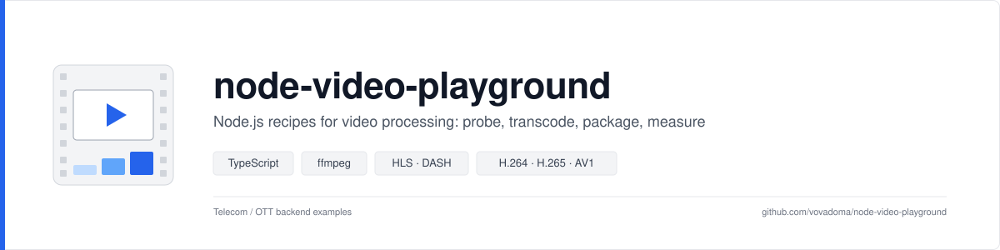
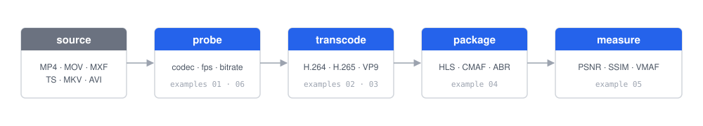

<p align="center">
  
</p>

<p align="center">
  <a href="#examples"></a>
  
  
  
  
</p>

<p align="center">
  <b>Small, readable Node.js recipes for the video operations a telecom / OTT backend runs every day.</b><br>
  Probe a file, transcode it, package it for streaming, cut thumbnails, measure quality — each one a single script you can lift into a real service.
</p>

---

## Why

Video tooling tends to come as either a giant SDK or a wall of ffmpeg flags copied from Stack Overflow. This repo sits in between: a ~150-line typed wrapper around `ffmpeg` / `ffprobe` (`src/lib/`) and one self-contained, commented example per topic. No build step, no framework, nothing to configure — `npm install` and run.

<p align="center">
  
</p>

## Quick start

```bash
git clone https://github.com/vovadoma/node-video-playground.git && cd node-video-playground
npm install                      # execa + tsx + typescript, that's it
npm run probe                    # ffprobe → typed JSON
npm run hls                      # ABR ladder → HLS/CMAF in one pass
```

**Requirements:** Node ≥ 20 and `ffmpeg` / `ffprobe` on `PATH` (`brew install ffmpeg`) with libx264, libx265, libvpx, libaom. `libvmaf` is optional.

## Test media

The repo ships its own test set in [`samples/`](samples/README.md) — 66 files, ~135 MB, every common container × codec combination plus HLS/DASH packages:

| Folder | What | Files |
|---|---|---|
| `samples/real-world/` | Real files from [projectivetech/media-samples](https://github.com/projectivetech/media-samples): MP4, MOV, MKV, WebM, AVI, FLV, WMV, MPG, MXF (incl. Avid OP-Atom DNxHD) | 11 |
| `samples/generated/` | One 10 s 720p test pattern encoded as H.264 / H.265 / AV1 / VP8 / VP9 / MPEG-2 / MJPEG / Xvid / Sorenson / WMV2 into MP4, fMP4, MOV, MKV, WebM, TS, PS, MXF, AVI, FLV, ASF — with AAC, Opus, Vorbis, MP2, MP3, AC-3, E-AC-3, PCM audio | 24 |
| `samples/streaming/` | HLS with TS segments + 3-rendition ABR ladder, HLS fMP4/CMAF, MPEG-DASH | 31 |

Two outputs are too big for GitHub and are git-ignored (ProRes 422 HQ `.mov` ~64 MB, DNxHR HQ `.mxf` ~123 MB). `npm run samples` regenerates the whole `generated/` + `streaming/` set, including those two, from the same ffmpeg recipes — so the matrix is reproducible, not just checked in. Point `SAMPLES_DIR` elsewhere to use your own media.

## Examples

| # | Run | What it shows |
|:-:|---|---|
| 01 | `npm run probe [file]` | `ffprobe` → typed `ProbeResult`: container, codecs, resolution, fps, bitrate |
| 02 | `npm run thumb [file]` | Poster frame, 4×3 contact sheet, sprite strip for scrub-bar previews |
| 03 | `npm run transcode [file]` | H.264 → H.265 / 480p H.264 / VP9 with a live progress bar and size deltas |
| 04 | `npm run hls [file]` | One-pass 720/480/360p ABR ladder into HLS with fMP4 (CMAF) segments + master playlist |
| 05 | `npm run quality` | PSNR / SSIM of every encode against the master, as a table |
| 06 | `npm run batch [dir]` | Walk a folder, probe every media file in parallel, print a table |

Any script also runs directly: `npx tsx examples/03-transcode.ts input.mov`. Results land in `./output/` (git-ignored).

### What it looks like

<table>
<tr>
<td width="50%" valign="top">

**02 — contact sheet** (`output/thumbs/contact-sheet.jpg`)


</td>
<td width="50%" valign="top">

**03 — transcode with progress**

```
Input: h264 1280x720, 5.09 MB
H.265 720p       [####################] 100% 2.9x
  -> h265_720p.mp4  2.84 MB  (44% smaller, 10.3s)
H.264 480p web   [####################] 100% 12.8x
  -> h264_480p.mp4  992 KB   (81% smaller, 0.8s)
VP9 WebM         [####################] 100% 3.1x
  -> vp9.webm       1.34 MB  (74% smaller, 3.2s)
```

**05 — quality vs. master**

```
file                    size    PSNR    SSIM
mkv_av1_opus.mkv     2.31 MB   43.58  0.9942
mp4_h264_aac.mp4     2.79 MB   42.75  0.9939
mp4_h265_aac.mp4     2.80 MB   42.47  0.9929
webm_vp9_opus.webm   1.59 MB   37.12  0.9792
```

</td>
</tr>
</table>

**04 — HLS master playlist** produced by a single ffmpeg invocation (three video + three audio renditions, aligned 2-second GOPs, 4-second CMAF segments):

```m3u8
#EXTM3U
#EXT-X-VERSION:7
#EXT-X-STREAM-INF:BANDWIDTH=2890800,RESOLUTION=1280x720,CODECS="avc1.64001f,mp4a.40.2"
720p/index.m3u8
#EXT-X-STREAM-INF:BANDWIDTH=1425600,RESOLUTION=854x480,CODECS="avc1.64001f,mp4a.40.2"
480p/index.m3u8
#EXT-X-STREAM-INF:BANDWIDTH=730400,RESOLUTION=640x360,CODECS="avc1.64001e,mp4a.40.2"
360p/index.m3u8
```

## How it's put together

```
src/lib/
  config.ts    SAMPLES_DIR / OUTPUT_DIR / binary paths · sample() & out() helpers · tiny .env loader
  ffprobe.ts   probe() → typed ProbeResult · probeSummary() for the common fields
  ffmpeg.ts    runFfmpeg() with -progress parsing & callbacks · runFfmpegCapture() for filter stats
  format.ts    humanBytes / humanDuration / kbps
examples/      01…06, one topic per file, numbered in learning order
scripts/       make-samples.ts — regenerates the sample matrix with ffmpeg
samples/       test media (see samples/README.md for the full catalog)
docs/          images for this README
```

The wrapper is deliberately thin. `runFfmpeg(args, { onProgress })` spawns the binary with `-progress pipe:1`, parses the `key=value` stream and hands you `{ frame, fps, timeSec, speed, percent }` — the same thing you'd feed into a job queue or a WebSocket. Everything else is plain ffmpeg arguments, so any recipe from the ffmpeg docs drops in unchanged.

## Configuration

Copy `.env.example` to `.env` or export variables; shell always wins.

| Variable | Default | Purpose |
|---|---|---|
| `SAMPLES_DIR` | `./samples` | where `sample('…')` looks for inputs |
| `OUTPUT_DIR` | `./output` | where `out('…')` writes results |
| `FFMPEG_BIN` / `FFPROBE_BIN` | `ffmpeg` / `ffprobe` | override binaries |

## Roadmap

- [ ] MPEG-DASH packaging sharing CMAF segments with HLS
- [ ] Server-side ad insertion: splice a bumper into a TS stream with `concat`
- [ ] Live: SRT/RTMP input → HLS folder with a sliding window
- [ ] Scene detection (`select='gt(scene,0.4)'`) for automatic chapters and thumbnails
- [ ] Loudness normalisation to EBU R128 (`loudnorm`)
- [ ] VMAF via `libvmaf` and a per-title encoding ladder
- [ ] Job queue on BullMQ + Redis with progress over WebSocket

## License

MIT. Generated test patterns come from ffmpeg's `testsrc2`; real-world samples from [projectivetech/media-samples](https://github.com/projectivetech/media-samples).
